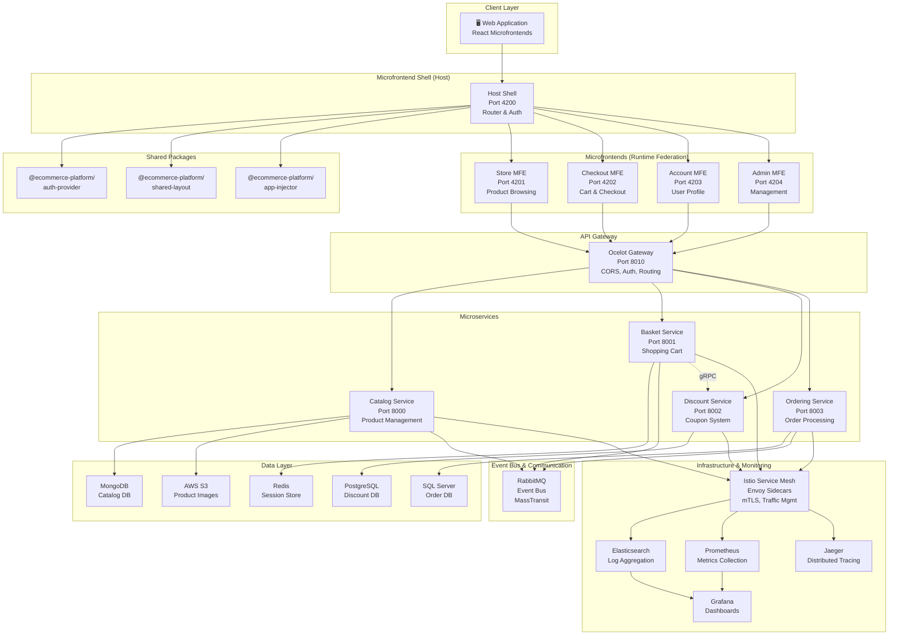
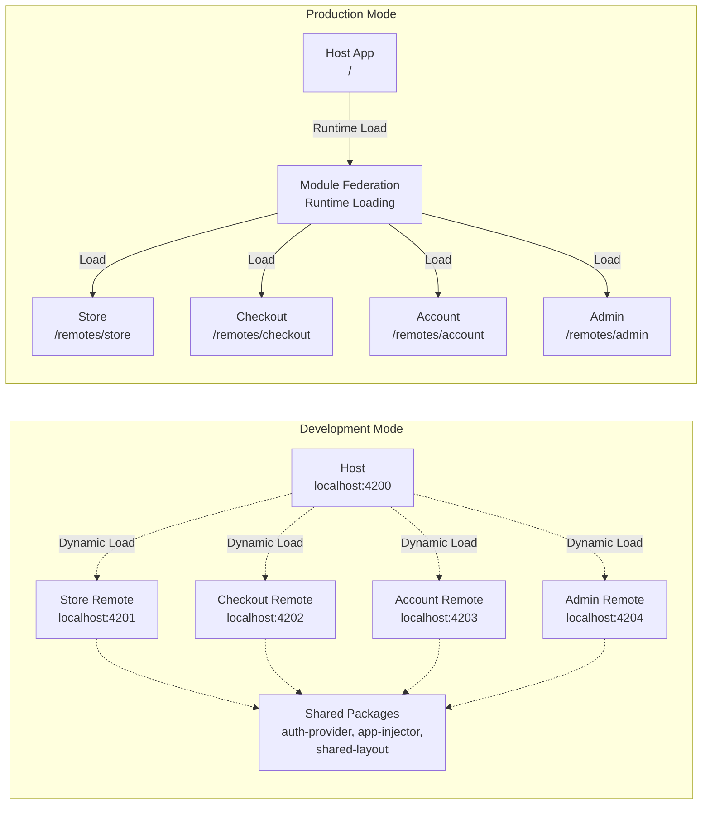
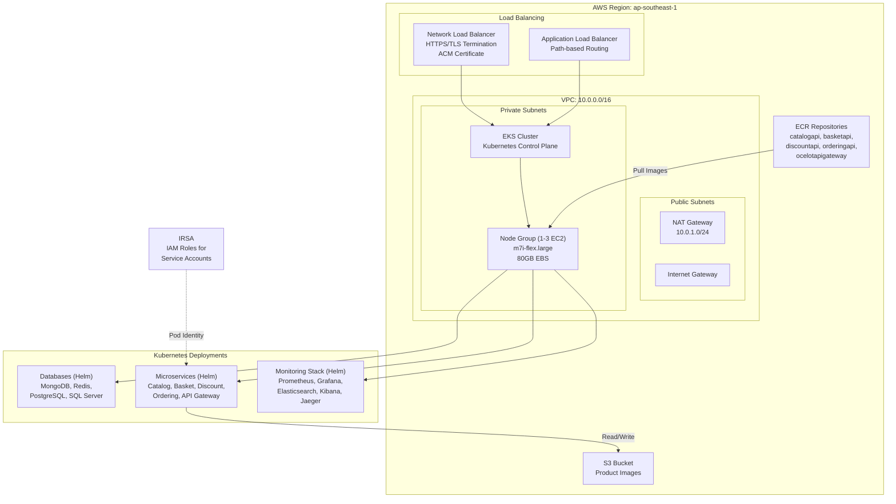
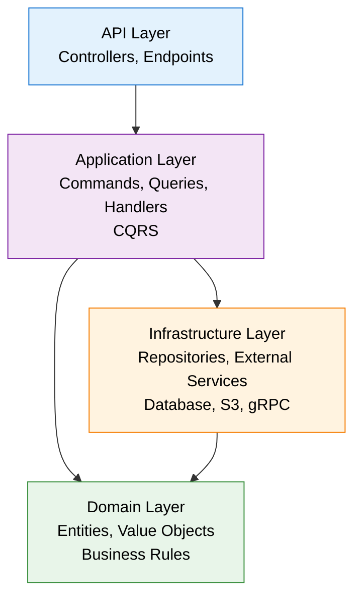

# Cloud-Native E-Commerce Platform

[](https://dotnet.microsoft.com/)
[](https://react.dev/)
[](https://nx.dev/)
[](https://www.typescriptlang.org/)
[](https://aws.amazon.com/eks/)
[](https://kubernetes.io/)
[](https://www.docker.com/)
[](LICENSE)

> **Enterprise-grade cloud-native e-commerce platform** built with modern microfrontend architecture, microservices, and cloud-native DevOps. Production-ready with full observability, security scanning, and multi-environment deployment.

## ✨ Key Features

- **🏗️ Microfrontend Architecture** - Webpack Module Federation with runtime composition, independent deployment, and shared authentication
- **☁️ Enterprise Cloud Infrastructure** - AWS EKS with auto-scaling, multi-AZ, CloudFormation IaC, and IRSA for secure AWS access
- **🎯 Microservices Backend** - Clean Architecture with CQRS pattern, event-driven design, and gRPC communication
- **📊 Full Observability** - Elastic Stack, Prometheus, Grafana, Jaeger distributed tracing, and Istio service mesh
- **🔒 Security & Compliance** - IRSA, Istio mTLS, Trivy/CodeQL scanning, secrets management (app-layer JWT auth planned)
- **🎨 Advanced Admin Dashboard** - Real-time analytics, activity tracking, product management, and audit logs
- **⚡ Developer Experience** - Nx monorepo with caching, hot reload, type-safe APIs, and E2E testing (Playwright)

## 🏛️ Architecture Overview

### System Architecture



### Microfrontend Architecture



### Cloud Infrastructure (AWS)



### Clean Architecture (Per Microservice)



## 🚀 Quick Start

Choose your deployment path:

### 📍 Option 1: Local Development (Minikube)

Best for: Development, testing, and learning

```bash
# Clone repository
git clone https://github.com/sloweyyy/cloud-native-ecommerce-platform.git
cd cloud-native-ecommerce-platform

# Deploy locally (all services + monitoring)
./scripts/deploy/deploy.sh
```

**Time**: ~15-20 minutes
**Includes**: Minikube cluster, all services, LocalStack (S3), monitoring stack (Prometheus, Grafana, Jaeger, Kibana)

### ☁️ Option 2: AWS Minimal (Cost-Optimized)

Best for: Budget-conscious deployments, small teams

```bash
# Deploy to AWS with minimal services
./scripts/deploy/deploy-aws-minimal.sh
```

**Time**: ~20-25 minutes
**Includes**: EKS cluster (single AZ), core services, AWS S3, no monitoring stack
**Cost**: ~$20-50/month

### 🏢 Option 3: AWS Production (Full Stack)

Best for: Production workloads, enterprise deployments

```bash
# Full production deployment with monitoring
./scripts/deploy/deploy-aws.sh
```

**Time**: ~30-40 minutes
**Includes**: Multi-AZ EKS, all services, full monitoring (Prometheus, Grafana, Jaeger, Elasticsearch, Kibana), HTTPS, auto-scaling
**Cost**: ~$150-300/month

For detailed deployment instructions, see [DEPLOYMENT-GUIDE.md](DEPLOYMENT-GUIDE.md)

## 📍 Access Services

### Frontend Applications

| Service | Local | Description |
| --- | --- | --- |
| **Host Shell** | [localhost:4200](http://localhost:4200) | Main application (router) |
| **Store** | [localhost:4201](http://localhost:4201) | Public product browsing |
| **Checkout** | [localhost:4202](http://localhost:4202) | Shopping cart & checkout |
| **Account** | [localhost:4203](http://localhost:4203) | User profile & orders |
| **Admin Dashboard** | [localhost:4204](http://localhost:4204) | Admin management |

### Backend Services

| Service | Local | Swagger UI |
| --- | --- | --- |
| **API Gateway** | [localhost:8010](http://localhost:8010) | [Swagger](http://localhost:8010/swagger) |
| **Catalog API** | [localhost:8000](http://localhost:8000) | [Swagger](http://localhost:8000/swagger) |
| **Basket API** | [localhost:8001](http://localhost:8001) | [Swagger](http://localhost:8001/swagger) |
| **Discount API** | [localhost:8002](http://localhost:8002) | [Swagger](http://localhost:8002/swagger) |
| **Ordering API** | [localhost:8003](http://localhost:8003) | [Swagger](http://localhost:8003/swagger) |

### Monitoring & Observability

| Tool | Local | Purpose |
| --- | --- | --- |
| **Prometheus** | [localhost:9090](http://localhost:9090) | Metrics collection |
| **Grafana** | [localhost:3000](http://localhost:3000) | Dashboards & visualization |
| **Kibana** | [localhost:5601](http://localhost:5601) | Log analytics |
| **Jaeger** | [localhost:16686](http://localhost:16686) | Distributed tracing |
| **Kiali** | [localhost:20001](http://localhost:20001) | Service mesh visualization |
| **RabbitMQ** | [localhost:15672](http://localhost:15672) | Message broker UI |

## 🛠️ Tech Stack

### Frontend Architecture

| Component | Technology | Version | Purpose |
| --- | --- | --- | --- |
| **Microfrontend Framework** | Webpack Module Federation | 5 | Runtime app composition |
| **Monorepo** | Nx | 21.6 | Build orchestration & caching |
| **Runtime** | React | 18.3 | UI framework |
| **Language** | TypeScript | 5.9 | Type-safe development |
| **Routing** | React Router (Host) / TanStack Router (Remotes) | 6 / 1 | URL management |
| **State Management** | TanStack Query + Zustand | 5 / 5 | Server + client state |
| **UI Components** | Ant Design | 5.22 | Component library |
| **Authentication** | Azure MSAL | 3.27 | OAuth/OIDC support |
| **Form Validation** | Zod | 3.24 | Type-safe validation |
| **Testing** | Playwright + Jest | 1.56 / 30 | E2E and unit tests |

### Backend Services

| Component | Technology | Version | Purpose |
| --- | --- | --- | --- |
| **Runtime** | .NET | 10.0 | Framework |
| **Framework** | ASP.NET Core | 10.0 | Web API |
| **Architecture** | Clean Architecture | - | SOLID principles |
| **Pattern** | CQRS + in-house Mediator | - | Command/Query separation (`Infrastructure/Common.Mediator`) |
| **ORM** | Entity Framework Core | 10.0 | Database abstraction |
| **Mapping** | Riok.Mapperly | 4.1 | Source-generated DTO mapping (no reflection) |
| **Validation** | FluentValidation | 11.12 | Input validation |
| **Communication** | gRPC + REST | - | Service communication |
| **API Documentation** | Swagger/OpenAPI | 3.0 | Interactive docs |

### Data & Storage

| Database | Type | Purpose | Port |
| --- | --- | --- | --- |
| **MongoDB** | Document DB | Product catalog | 27017 |
| **Redis** | Cache/Session | Shopping baskets | 6379 |
| **PostgreSQL** | Relational | Discount coupons | 5432 |
| **SQL Server** | Relational | Orders & activity | 1433 |
| **AWS S3** | Object Storage | Product images | - |

### Message Bus & Communication

| Technology | Purpose |
| --- | --- |
| **RabbitMQ** | Event bus for asynchronous communication |
| **MassTransit** | .NET messaging framework |
| **gRPC** | High-performance RPC (Basket → Discount) |
| **REST/JSON** | Client-facing APIs |

### Cloud & DevOps

| Component | Technology | Purpose |
| --- | --- | --- |
| **Container Platform** | Docker | Application containerization |
| **Orchestration** | Kubernetes (EKS) | Container management |
| **IaC** | CloudFormation + Helm | Infrastructure automation |
| **Service Mesh** | Istio (1.20) | Traffic management, security |
| **CI/CD** | GitHub Actions | Automated build & deploy |
| **Container Registry** | ECR (AWS) / GHCR (GitHub) | Image storage |
| **Local Development** | Minikube + LocalStack | Local simulation |

### Monitoring & Observability

| Stack | Components | Purpose |
| --- | --- | --- |
| **Logs** | Serilog → Elasticsearch → Kibana | Centralized logging |
| **Metrics** | Prometheus | Metrics collection (15s scrape) |
| **Dashboards** | Grafana | Metrics visualization |
| **Traces** | Jaeger Collector | Distributed tracing |
| **Service Mesh** | Istio + Envoy sidecars | Service observability |
| **Topology** | Kiali | Service mesh visualization |
| **Health Checks** | Custom endpoints | Service health monitoring |

## 📦 Project Structure

```text
cloud-native-ecommerce-platform/
│
├── 📁 micro-frontends/          # Microfrontend monorepo (Nx)
│   ├── host/                             # Shell app (Host) - Router, Auth
│   ├── store/                            # Store MFE - Product browsing
│   ├── checkout/                         # Checkout MFE - Cart & checkout
│   ├── account/                          # Account MFE - User profile
│   ├── admin/                            # Admin MFE - Management dashboard
│   ├── packages/
│   │   ├── app-injector/                 # MFE injection utilities
│   │   ├── auth-provider/                # Shared authentication provider
│   │   └── shared-layout/                # Shared UI components (Navbar, Footer)
│   ├── e2e/                              # E2E tests (Playwright)
│   ├── nx.json                           # Nx configuration
│   ├── tsconfig.base.json                # TypeScript base config
│   └── package.json                      # Dependencies
│
├── 📁 Services/                          # Backend microservices (.NET 10)
│   ├── Catalog/
│   │   ├── Catalog.API/                  # REST endpoints
│   │   ├── Catalog.Core/                 # Domain entities
│   │   └── Catalog.Infrastructure/       # MongoDB, S3
│   ├── Basket/
│   │   ├── Basket.API/                   # REST endpoints
│   │   ├── Basket.Core/                  # Domain entities
│   │   └── Basket.Infrastructure/        # Redis, gRPC client
│   ├── Discount/
│   │   ├── Discount.API/                 # gRPC & REST endpoints
│   │   ├── Discount.Core/                # Domain entities
│   │   └── Discount.Infrastructure/      # PostgreSQL
│   └── Ordering/
│       ├── Ordering.API/                 # REST endpoints
│       ├── Ordering.Core/                # Domain entities, Activity tracking
│       └── Ordering.Infrastructure/      # SQL Server, RabbitMQ consumer
│
├── 📁 ApiGateways/
│   └── Ocelot.ApiGateway/                # API Gateway configuration
│
├── 📁 Infrastructure/                    # Shared libraries & IaC
│   ├── aws/
│   │   └── cloudformation/               # AWS infrastructure templates
│   │       ├── vpc.yaml                  # VPC, subnets, NAT
│   │       ├── eks-cluster.yaml          # EKS cluster & node groups
│   │       ├── minimal-stack.yaml        # Combined VPC + EKS
│   │       └── alb-ingress.yaml          # Load balancer
│   └── EventBus/                         # RabbitMQ, MassTransit setup
│
├── 📁 Deployments/
│   ├── helm/                             # Helm charts (19 total)
│   │   ├── catalogdb/                    # MongoDB chart
│   │   ├── basketdb/                     # Redis chart
│   │   ├── discountdb/                   # PostgreSQL chart
│   │   ├── orderdb/                      # SQL Server chart
│   │   ├── rabbitmq/                     # RabbitMQ chart
│   │   ├── catalog/                      # Catalog service chart
│   │   ├── basket/                       # Basket service chart
│   │   ├── discount/                     # Discount service chart
│   │   ├── ordering/                     # Ordering service chart
│   │   ├── ocelotapigw/                  # API Gateway chart
│   │   ├── prometheus/                   # Prometheus chart
│   │   ├── grafana/                      # Grafana chart
│   │   ├── elasticsearch/                # Elasticsearch chart
│   │   └── kibana/                       # Kibana chart
│   ├── k8s/                              # Kubernetes manifests
│   │   ├── deployments/                  # Service deployments
│   │   ├── services/                     # Service definitions
│   │   ├── ingress/                      # Ingress rules
│   │   └── monitoring/                   # Monitoring resources
│   └── monitoring/                       # Observability configs
│
├── 📁 .github/
│   └── workflows/                        # CI/CD pipelines
│       ├── ci.yml                        # Build, test, security scan
│       ├── cd.yml                        # Build images, push ECR, deploy
│       └── docker.yml                    # Publish to GHCR
│
├── 📁 scripts/
│   ├── deploy/                           # Deployment scripts
│   │   ├── deploy.sh                     # Local Minikube deployment
│   │   ├── deploy-aws.sh                 # Full AWS EKS deployment
│   │   ├── deploy-aws-minimal.sh         # Cost-optimized AWS deployment
│   │   ├── docker-deploy.sh              # Docker Compose deployment
│   │   └── build-images.sh               # Build Docker images
│   ├── cleanup/                          # Resource teardown
│   ├── access/                           # Service access portals
│   ├── debug/                            # Debugging utilities
│   └── monitoring/                       # Observability setup scripts
│
├── 📁 tools/postman/                     # API testing collections
├── 📁 diagrams/                          # Architecture diagrams (eraser.io)
│
├── README.md                             # This file
├── DEPLOYMENT-GUIDE.md                   # Detailed deployment docs
├── LICENSE                               # MIT License
└── docker-compose.yml                    # Local development stack
```

## 🧠 Architecture Patterns & Design

### Microfrontend Architecture

The platform uses **Webpack Module Federation** with a shell-based orchestration pattern:

- **Host Application** (Shell): Manages routing, authentication, shared layout
- **Remote Applications**: Store, Checkout, Account, Admin - independently deployed
- **Shared Packages**: Common authentication, UI components, injection utilities
- **Runtime Loading**: Remotes loaded dynamically at runtime (no compile-time dependencies)
- **Development**: Each micro-app runs on separate port (4200-4204)
- **Production**: All apps bundled together, remotes served from `/remotes/` directory

**Benefits**:

- ✅ Independent deployability per micro-app
- ✅ Team autonomy (each team owns a micro-app)
- ✅ Technology flexibility (each remote can use different versions)
- ✅ Better performance (lazy loading of remotes)

### Backend Architecture

Each microservice follows **Clean Architecture** with **CQRS Pattern**:

```text
Controllers/Endpoints → Mediator Pipeline → Commands/Queries
                                              ↓
                                    Command Handlers / Query Handlers
                                              ↓
                                         Domain Layer
                                              ↓
                                      Infrastructure (Repositories, Services)
                                              ↓
                                        Data Layer
```

### Communication Patterns

1. **Synchronous**: REST APIs, gRPC (Basket ↔ Discount)
2. **Asynchronous**: RabbitMQ with MassTransit (Event-driven)
3. **Frontend-Backend**: REST APIs with JWT authentication

### Security Architecture

- **Authentication**: JWT planned (no auth middleware currently wired up)
- **Authorization**: Role-based access control (RBAC)
- **Service-to-Service**: Istio mTLS for encrypted communication
- **Data Security**: Encryption at rest (S3, databases) and in transit (HTTPS/TLS)

## 🏢 Business Features

### Product Management

- Full CRUD operations for products
- Brand and type management
- Image upload & storage (AWS S3 or LocalStack)
- Product search and filtering

### Shopping Experience

- Real-time shopping basket (Redis-backed)
- Coupon/discount application
- Product recommendations
- Multi-item checkout

### Order Processing

- Event-driven order creation
- Order status tracking
- Payment information handling
- Order history and details

### Admin Dashboard

- **Products**: CRUD, bulk upload, categorization
- **Orders**: View, manage, track
- **Brands & Types**: Management
- **Activity Tracking**: Audit log of all changes
- **Analytics**: Real-time statistics and insights

### Activity Tracking & Audit

- Track all product changes (Create, Update, Delete)
- Track all order lifecycle events
- User accountability
- Compliance reporting

## 🧪 Testing

### E2E Testing (Playwright)

```bash
cd micro-frontends
npm run test:e2e              # Run all tests
npm run test:e2e:ui           # Interactive mode
npm run test:e2e:debug        # Debug mode
npm run test:e2e:report       # View report
```

Tests cover:

- Cross-microfrontend navigation
- Authentication flows
- Shopping journey (browse → add to cart → checkout)
- Admin dashboard functionality
- Error handling

### Unit Tests

```bash
# Frontend tests
npm test                      # All frontend tests
npm run test:coverage         # Coverage report

# Backend tests
dotnet test                   # All backend tests
dotnet test --filter Category=Integration  # Integration tests only
```

### API Testing (Postman)

- Pre-built Postman collections for all services
- Located in: [tools/postman/](tools/postman/)

## 🔒 Security

### Application Security

- **JWT Authentication** (planned — not yet wired up)
- **Role-Based Access Control** (RBAC)
- **Input Validation** with FluentValidation
- **SQL Injection Prevention** via parameterized queries & ORM
- **CORS Configuration** at API Gateway level

### Cloud Security

- **IRSA** (IAM Roles for Service Accounts) - no static credentials
- **Secrets Management** via Kubernetes Secrets
- **Network Policies** for pod-to-pod communication
- **Service Mesh mTLS** for encrypted communication

### CI/CD Security

- **Trivy** for container image scanning
- **CodeQL** for static code analysis
- **Dependency Scanning** via GitHub Dependabot
- **SBOM Generation** for supply chain security

### Data Protection

- **Encryption at Rest**: All databases encrypted
- **Encryption in Transit**: HTTPS/TLS for all connections
- **S3 Bucket Policies**: Restricted access to product images

## 📊 Monitoring & Observability

The platform follows the **3 Pillars of Observability**:

### 1️⃣ Logs (ELK Stack)

- **Serilog**: Structured logging in backend
- **Elasticsearch**: Log aggregation and indexing
- **Kibana**: Log exploration and visualization
- **Access**: [Kibana at localhost:5601](http://localhost:5601)

### 2️⃣ Metrics (Prometheus & Grafana)

- **Prometheus**: Metrics collection (15-second scrape interval)
- **Scrape Targets**: API servers, Node Exporter, Kubernetes components
- **Grafana**: Custom dashboards for application and infrastructure metrics
- **Access**:
  - [Prometheus at localhost:9090](http://localhost:9090)
  - [Grafana at localhost:3000](http://localhost:3000)

### 3️⃣ Traces (Jaeger & Istio)

- **Istio/Envoy**: Automatic trace collection (service mesh layer)
- **Jaeger Collector**: Trace aggregation
- **Jaeger UI**: Trace visualization and analysis
- **Access**: [Jaeger at localhost:16686](http://localhost:16686)

### Service Mesh Visualization

- **Kiali**: Real-time service topology, traffic flows, and health
- **Access**: [Kiali at localhost:20001](http://localhost:20001)

### Health Checks

All services expose health check endpoints:

- `/health` - Service health status
- `/health/live` - Liveness probe
- `/health/ready` - Readiness probe

## ⚙️ CI/CD Pipeline

### GitHub Actions Workflows

#### 1. CI Pipeline (Continuous Integration)

Triggered on: Pull requests, pushes to main

**Steps**:

1. **Code Quality**
   - Build .NET 10 backend
   - Run backend unit tests (with Cobertura coverage)
   - Run frontend tests via Nx affected
   - ESLint and Prettier

2. **Security Scanning**
   - Trivy: Container vulnerability scanning
   - CodeQL: Static code analysis (C#, TypeScript)

3. **Docker Build**
   - Build all 5 microservice images
   - Multi-arch support (linux/amd64)
   - Cache integration for speed

4. **Integration Tests**
   - Start service containers (Redis, PostgreSQL, MongoDB, RabbitMQ)
   - Run integration test suite

5. **Deployment Validation**
   - Helm chart linting
   - Kubernetes manifest validation

#### 2. CD Pipeline (Continuous Deployment)

Triggered on: Tags, manual workflow dispatch

**Steps**:

1. **Build & Push to ECR**
   - Build 5 microservice images
   - Push to AWS ECR
   - Scan images with Trivy
   - Tag: latest, git sha, version

2. **Deploy to EKS** (per environment)
   - Environment-specific deployment (dev/staging/prod)
   - Helm upgrade --install for databases
   - Helm upgrade --install for services
   - S3 configuration and image migration
   - Health checks and smoke tests

#### 3. Docker Pipeline

Triggered on: Pushes to main/release branches

**Steps**:

- Build 5 microservice images
- Publish to GitHub Container Registry (GHCR)
- Automatic semantic versioning
- Security scanning with Trivy

## 🚀 Deployment

### Local Development

```bash
# Requires: Docker, Docker Compose, Minikube, Helm, kubectl

# Start everything locally
./scripts/deploy/deploy.sh

# Access at http://localhost:4200
```

**What's deployed**:

- Minikube Kubernetes cluster (10GB RAM, 8 CPUs)
- All 5 microservices
- All 4 databases
- RabbitMQ message broker
- LocalStack (S3 emulation)
- Monitoring stack (Prometheus, Grafana, Elasticsearch, Kibana, Jaeger)

### AWS Deployment

#### Prerequisites

```bash
aws configure                    # Configure AWS credentials
export AWS_REGION=ap-southeast-1 # Set region
```

#### Full Production Deployment

```bash
./scripts/deploy/deploy-aws.sh
```

**What's deployed**:

- AWS EKS cluster (multi-AZ)
- EC2 node group (1-3 m7i-flex.large instances)
- RDS-managed databases (in Kubernetes)
- Network Load Balancer with HTTPS
- Full monitoring stack
- Auto-scaling policies (HPA)

**Time**: ~30-40 minutes
**Cost**: ~$150-300/month

#### Minimal Deployment (Cost-Optimized)

```bash
./scripts/deploy/deploy-aws-minimal.sh
```

**What's deployed**:

- AWS EKS cluster (single AZ)
- Single m7i-flex.large node (1-3 auto-scaling)
- Core services only (no monitoring)
- AWS S3 for image storage

**Time**: ~20-25 minutes
**Cost**: ~$20-50/month

### Configuration

For detailed configuration options, see:

- [Deployments/DEPLOYMENT-CONFIGURATION.md](Deployments/DEPLOYMENT-CONFIGURATION.md)
- [DEPLOYMENT-GUIDE.md](DEPLOYMENT-GUIDE.md)

## 💻 Development

### Frontend Development

```bash
cd micro-frontends

# Install dependencies
npm install

# Start all micro-apps in parallel
npm start

# Or run individual micro-apps
npm run start:host     # Port 4200
npm run start:store    # Port 4201
npm run start:checkout # Port 4202
npm run start:account  # Port 4203
npm run start:admin    # Port 4204
```

### Backend Development

```bash
# Catalog Service
cd Services/Catalog/Catalog.API
dotnet watch run        # Auto-reload on changes

# Other services (similar pattern)
cd Services/Basket/Basket.API && dotnet watch run
cd Services/Discount/Discount.API && dotnet watch run
cd Services/Ordering/Ordering.API && dotnet watch run
```

### Available npm Commands

```bash
# Building
npm run build          # Build all apps (dev)
npm run build:prod     # Build all apps (production)
npm run build:packages # Build shared packages

# Testing
npm test              # Run all tests
npm run test:watch    # Watch mode
npm run test:coverage # Coverage report
npm run test:e2e      # E2E tests (Playwright)

# Linting & Formatting
npm run lint          # ESLint
npm run lint:fix      # Fix linting issues
npm run format        # Prettier

# Nx Commands
npm run affected:test   # Test affected apps
npm run affected:build  # Build affected apps
npm run graph          # View dependency graph
npm run clean          # Clean cache and dist
```

## 🤝 Contributing

We welcome contributions! Please see [CONTRIBUTING.md](CONTRIBUTING.md) for:

- Development environment setup
- Coding standards and guidelines
- Testing requirements
- Pull request process
- Issue reporting guidelines

Also review:

- [CODE_OF_CONDUCT.md](CODE_OF_CONDUCT.md)
- [SECURITY.md](SECURITY.md)

## 📚 Documentation

- [DEPLOYMENT-GUIDE.md](DEPLOYMENT-GUIDE.md) - Complete deployment instructions
- [Deployments/DEPLOYMENT-CONFIGURATION.md](Deployments/DEPLOYMENT-CONFIGURATION.md) - Service configurations
- [scripts/README.md](scripts/README.md) - Script reference guide
- [diagrams/](diagrams/) - Architecture diagrams

## 📄 License

This project is licensed under the MIT License - see the [LICENSE](LICENSE) file for details.

## 🙋 Support

For issues and questions:

- 🐛 [GitHub Issues](https://github.com/sloweyyy/cloud-native-ecommerce-platform/issues)
- 💬 [GitHub Discussions](https://github.com/sloweyyy/cloud-native-ecommerce-platform/discussions)
- 📧 Create a detailed issue with reproduction steps
