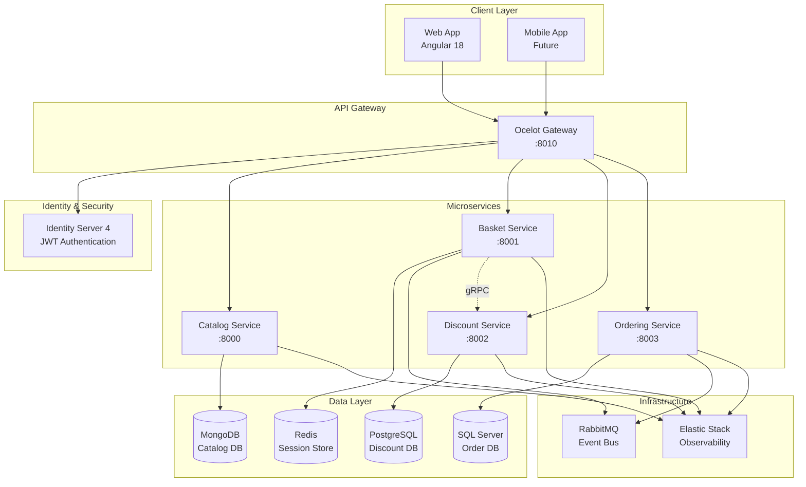
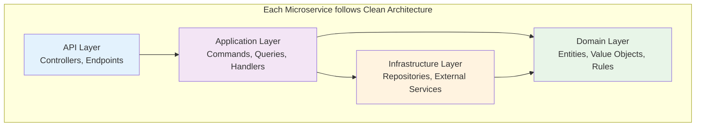
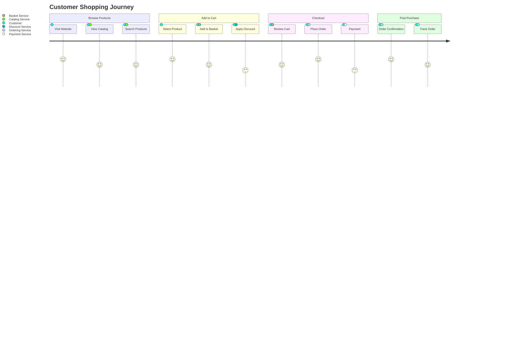

# Cloud-Native E-commerce Platform

[](https://dotnet.microsoft.com/)
[](https://angular.io/)
[](https://www.docker.com/)
[](https://kubernetes.io/)
[](LICENSE)

> A comprehensive cloud-native e-commerce platform built with microservices architecture, demonstrating modern software engineering practices and cloud technologies.

## Features

- **Microservices Architecture** - Clean separation of concerns with independent deployable services
- **Event-Driven Design** - Asynchronous communication using RabbitMQ message broker
- **Cloud-Native** - Kubernetes deployment with Helm charts and Istio service mesh
- **Observability** - Comprehensive monitoring with Elastic Stack and distributed tracing
- **Security** - JWT authentication and authorization with Identity Server
- **API Gateway** - Centralized routing and cross-cutting concerns with Ocelot
- **Modern UI** - Responsive Angular frontend with Material Design

## Architecture Overview

### System Architecture



### Clean Architecture Pattern



## Quick Start

### Prerequisites

- [Docker](https://www.docker.com/) & Docker Compose
- [.NET 8 SDK](https://dotnet.microsoft.com/download/dotnet/8.0)
- [Node.js 18+](https://nodejs.org/) & npm
- [Kubernetes](https://kubernetes.io/) (optional, for K8s deployment)

### Local Development

```bash
# Clone the repository
git clone https://github.com/sloweyyy/cloud-native-ecommerce-platform.git
cd cloud-native-ecommerce-platform

# Start all services with Docker Compose
docker-compose -f docker-compose.yml -f docker-compose.override.yml up -d 

# Or use the deployment script
./deploy.sh
```

### Access Applications

| Service | URL | Description |
|---------|-----|-------------|
| Web App | [http://localhost:4200](http://localhost:4200) | Angular Frontend |
| API Gateway | [http://localhost:8010](http://localhost:8010) | Ocelot Gateway |
| Kibana | [http://localhost:5601](http://localhost:5601) | Log Analytics |
| RabbitMQ | [http://localhost:15672](http://localhost:15672) | Message Broker UI |
| Prometheus | [http://localhost:9090](http://localhost:9090) | Metrics |
| Grafana | [http://localhost:3000](http://localhost:3000) | Dashboards |

## Tech Stack

### Backend Services

- **.NET 8** - Modern C# runtime and framework
- **ASP.NET Core** - Web API framework
- **MediatR** - CQRS and Mediator pattern implementation
- **AutoMapper** - Object-to-object mapping
- **FluentValidation** - Input validation
- **Serilog** - Structured logging

### Databases & Storage

- **MongoDB** - Document database for catalog service
- **Redis** - In-memory cache for basket service
- **PostgreSQL** - Relational database for discount service
- **SQL Server** - Enterprise database for ordering service

### Message Broker & Communication

- **RabbitMQ** - Asynchronous messaging
- **gRPC** - High-performance RPC framework
- **SignalR** - Real-time communication

### Frontend

- **Angular 18** - Modern web framework
- **TypeScript** - Type-safe JavaScript
- **Angular Material** - UI component library
- **RxJS** - Reactive programming
- **NgRx** - State management (optional)

### Infrastructure & DevOps

- **Docker** - Containerization
- **Kubernetes** - Container orchestration
- **Helm** - Kubernetes package manager
- **Istio** - Service mesh
- **Ocelot** - API Gateway
- **Identity Server 4** - Authentication & authorization

### Monitoring & Observability

- **Elasticsearch** - Search and analytics engine
- **Kibana** - Data visualization
- **Prometheus** - Metrics collection
- **Grafana** - Monitoring dashboards
- **Jaeger** - Distributed tracing

## Business Flow

### E-commerce User Journey



## Project Structure

```
├── Services/                    # Microservices
│   ├── Catalog/                # Product catalog service
│   ├── Basket/                 # Shopping basket service  
│   ├── Discount/               # Discount management service
│   └── Ordering/               # Order processing service
├── client/                     # Angular frontend
├── ApiGateways/                # API gateway
├── Infrastructure/             # Shared libraries
├── Deployments/                # K8s & Helm charts
└── PostmanCollection/          # API testing
```

## Configuration

### Environment Variables

```bash
# Database Connections
CATALOG_DB=mongodb://localhost:27017/catalog
BASKET_DB=redis://localhost:6379
DISCOUNT_DB=postgresql://localhost:5432/discount
ORDERING_DB=sqlserver://localhost:1433/ordering

# Message Broker
RABBITMQ_URL=amqp://localhost:5672

# Monitoring
ELASTICSEARCH_URL=http://localhost:9200
```

## Testing

```bash
# Run unit tests
dotnet test

# Run integration tests
dotnet test --filter Category=Integration

# API testing with Postman collections
newman run PostmanCollection/
```

## Monitoring & Observability

The platform includes comprehensive monitoring capabilities:

- **Application Metrics** - Custom business metrics via Prometheus
- **Infrastructure Monitoring** - Container and cluster metrics
- **Distributed Tracing** - Request tracing across microservices
- **Centralized Logging** - Structured logs aggregated in Elasticsearch
- **Health Checks** - Service health monitoring and alerting

## Security

- **Authentication** - JWT tokens via Identity Server 4
- **Authorization** - Role-based access control
- **API Security** - Rate limiting and request validation
- **Network Security** - Service mesh with mTLS
- **Data Protection** - Encryption at rest and in transit

## Deployment

For detailed deployment instructions, please refer to our comprehensive deployment guides:

- [Quick Start Guide](DEPLOYMENT-QUICKSTART.md) - Get up and running in minutes
- [Complete Deployment Guide](DEPLOYMENT-GUIDE-COMPLETE.md) - Detailed step-by-step instructions
- [Deployment Configuration Guide](Deployments/DEPLOYMENT-CONFIGURATION.md) - Current service configurations and port mappings
- **Deployment Scripts**:
  - `./deploy.sh` - Full deployment with monitoring
  - `./quick-deploy.sh` - Minimal deployment for development
  - `./start.sh` - Start existing deployment
  - `./cleanup.sh` - Clean up all resources

### Quick Commands

```bash
# One-command deployment (15-20 minutes)
./deploy.sh

# Quick development setup (5 minutes)
./quick-deploy.sh

# Start existing deployment (30 seconds)
./start.sh

# Complete cleanup
./cleanup.sh
```

## Contributing

We welcome contributions! Please see our [Contributing Guide](CONTRIBUTING.md) for details on:

- Setting up the development environment
- Coding standards and guidelines
- Testing requirements
- Pull request process
- Issue reporting guidelines

Also review our [Code of Conduct](CODE_OF_CONDUCT.md) and [Security Policy](SECURITY.md).

## License

This project is licensed under the MIT License - see the [LICENSE](LICENSE) file for details.
